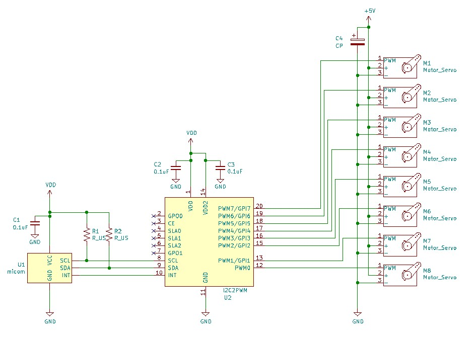

# I2C control PWM generater for servo. (緑豆壱拾仇號)  
  
GreenPAK用のデザインデータです。  
I2Cで模型用サーボを最大8個制御することができます。（サーボ用PWMを最大8ch生成）  
同時にGPOを追加することもできます。  
SLG46826V(STQFN) または SLG46826G(TSSOP) に対応しています。   

## 機能
- I2Cアドレスで最大8つのPWMを発生可能
- PWM 8chに加え、2つのGPO（汎用出力端子）が利用可能
- PWMに使わない端子をGPI（汎用入力端子）として利用可能
- 本デバイスをI2Cバスに8個ぶら下げて、最大64個の模型用サーボが制御可能（理論値）
  
### 本デザインの使用イメージ
  
  
## ピンアサイン
STQFN Pin # | TSSOP Pin # | 機能名 | IO | 内蔵抵抗 | SLG46826端子名 | 機能
--- | --- | --- | --- | --- | --- | ---
1 | 20 | VDD  |   |   | VDD |  2.3V～5.5V
2 | 19 | GPO0 | O | - | IO0 | General-purpose output 0
3 | 18 | CE   | I | PU10k | IO1 | Chip enable (active High)
4 | 17 | SLA0 | I | PU10k | IO2 | I2C slave address 0
5 | 16 | SLA1 | I | PD10k | IO3 | I2C slave address 1
6 | 15 | SLA2 | I | PD10k | IO4 | I2C slave address 2
7 | 14 | GPO1 | O | - | IO5 | General-purpose output 1
8 | 13 | SCL | I | - | SCL | SCL for SLG46826
9 | 12 | SDA | I/O | - | SDA | SDA for SLG46826
10 | 11 | INT | O | - | IO6 | Interrupt flag output
11 | 10 | GND |  |  | GND |  GND
12 | 9 | PWM0 | O | - | IO7 | PWM output 0
13 | 8 | PWM1/GPI1 | I/O | PD100k | IO8 | PWM output 1 or general-purpose input 1
14 | 7 | VDD2 |  |  | VDD2 |  2.3V～5.5V, VDD2≦VDD
15 | 6 | PWM2/GPI2 | I/O | PD100k | IO9  | PWM output 2 or general-purpose input 2
16 | 5 | PWM3/GPI3 | I/O | PD100k | IO10 | PWM output 3 or general-purpose input 3
17 | 4 | PWM4/GPI4 | I/O | PD100k | IO11 | PWM output 4 or general-purpose input 4
18 | 3 | PWM5/GPI5 | I/O | PD100k | IO12 | PWM output 5 or general-purpose input 5
19 | 2 | PWM6/GPI6 | I/O | PD100k | IO13 | PWM output 6 or general-purpose input 6
20 | 1 | PWM7/GPI7 | I/O | PD100k | IO14 | PWM output 7 or general-purpose input 7

### 内蔵抵抗
各端子の内蔵抵抗を有効にしてありますので、外付けプルアップ／プルダウン抵抗を省略できます。   
(不要な場合や値を変更したい場合などは設計ツールでI/Oのプロパティを書き換えてください)   
記号はおおよその抵抗値を表しており、値は以下の通りです。  
- PD10k Pull-down 10k ohm  
- PD100k Pull-down 100k ohm  
- PU10k Pull-up 10k ohm  
- PU100k Pull-up 100k ohm  
  
### I2Cアドレスの選択
I2Cアドレスの選択は、端子SLA2,SLA1,SLA0で行います。  
端子SLA2～0をHighまたはLowとすることで使用するI2Cアドレスを選択することができます。  
端子SLA2～0とI2Cアドレスの対応は下表の通りです。  
I2Cアドレスの下位2ビットを0または1にすることで、設定用(configuration)レジスタにアクセスすることができます。  
下位2ビットを2または3としたアドレスは回路書換用に予約されていますので、不用意にアクセスを行わないでください。  
※I2Cアドレスの最上位1ビットは固定です。変更するには設計ツールでI2Cのプロパティを書き換えてください。  
  
SLA2 | SLA1 | SLA0 | binary | I2C address | comment
--- | --- | --- | --- | --- | ---
open | open | open | 00010xx | 0x08 0x09~0x0B | for configuration reserved 
Low  | Low  | Low  | 00000xx | 0x01 0x02~0x03 | for configuration reserved 
Low  | Low  | High | 00010xx | 0x08 0x09~0x0B | for configuration reserved 
Low  | High | Low  | 00100xx | 0x10 0x11~0x13 | for configuration reserved 
Low  | High | High | 00110xx | 0x18 0x18~0x1B | for configuration reserved 
High | Low  | Low  | 01000xx | 0x20 0x21~0x23 | for configuration reserved 
High | Low  | High | 01010xx | 0x28 0x29~0x2B | for configuration reserved 
High | High | Low  | 01100xx | 0x30 0x31~0x33 | for configuration reserved 
High | High | High | 01110xx | 0x38 0x38~0x3B | for configuration reserved 

## 設定レジスタ
レジスタ一覧を下記に示します。  
  
| address | W/R | default| bit | Definition 
| --- | --- | --- | ---| ---
| 0x00 | W | 0x3E | [7:0] | Interrupt flag(INT) reset 0x3E→0x00 or 0x00→0x3E toggle for reset
| 0x74 | R | --   | [7]   | PIO1 input value 0:Low, 1:High
| | | | [6:0] | *Reserved*
| 0x75 | R | -- | [7:6] | *Reserved*
| | | | [5] | PIO7 input value 0:Low, 1:High
| | | | [4] | PIO6 input value 0:Low, 1:High
| | | | [3] | PIO5 input value 0:Low, 1:High
| | | | [2] | PIO4 input value 0:Low, 1:High
| | | | [1] | PIO3 input value 0:Low, 1:High
| | | | [0] | PIO2 input value 0:Low, 1:High
| 0x7A | W | 0x00 | [7] | PWM7 control, 1:ON, 0:OFF(PIO7 input & Pull down)
| | | | [6] | PWM6 control, 1:ON, 0:OFF(PIO6 input & Pull down)
| | | | [5] | PWM5 control, 1:ON, 0:OFF(PIO5 input & Pull down)
| | | | [4] | PWM4 control, 1:ON, 0:OFF(PIO4 input & Pull down)
| | | | [3] | PWM3 control, 1:ON, 0:OFF(PIO3 input & Pull down)
| | | | [2] | PWM2 control, 1:ON, 0:OFF(PIO2 input & Pull down)
| | | | [1] | PWM1 control, 1:ON, 0:OFF(PIO1 input & Pull down)
| | | | [0] | PWM0 control, 1:ON, 0:OFF(INT outut)
| 0x7C | W | 0x7C | [7:0] | on time of PWM0
| 0xAA | W | 0x7C | [7:0] | on time of PWM1
| 0xAF | W | 0x7C | [7:0] | on time of PWM2
| 0xB3 | W | 0x7C | [7:0] | on time of PWM3
| 0xB8 | W | 0x7C | [7:0] | on time of PWM4
| 0cBC | W | 0x7C | [7:0] | on time of PWM5
| 0xC1 | W | 0x7C | [7:0] | on time of PWM6
| 0xC6 | W | 0x7C | [7:0] | on time of PWM7
| 0xC7 | W | 0x0C | [7:4] | *Reserved (0)*
| | | | [3:2] | GPO1 control 2:output Low, 3: output High
| | | | [1:0] | GPO0 control 2:output Low, 3: output High
    
### PWMとGPIの切り替え
PWM1～PWM7は汎用入力として使用することができます。設定はアドレス0x7Aで行います。  
1を設定するとPWM出力、0を設定するとPWM停止です。（デフォルトは0）  
PWMを使わない時は0のままとすることで、端子の状態をアドレス0x74またはアドレス0x75からリードすることができます。  

### PWMのパルス幅
パルス幅は、一般的な模型用サーボの合わせて 0.49ms～2.48msの間を8bit分解能で設定することができます。
High期間（H[ms])は以下の式で計算した値をアドレス0x7C～0ｘC6のPWM0～PWM7に対応するレジスタに設定します。  
設定値＝(H-0.469)*128-2  

#### 参考設定値
|Servo|angle|time|value
| --- | --- | --- | ---
|SG90 | -90 | 0.50 | 0x02
| | 0 | 1.45 | 0x7C
| | 90 | 2.40 | 0xF5
|FT90B | -90 | 0.70 | 0x1C
| | 0 | 1.50 | 0x82
| | 90 | 2.30 | 0xE8
|MG92B | -80 | 0.50 | 0x02
| | 0 | 1.45 | 0x7C
| | 80 | 2.40 | 0xF5
|FS90 | -max | 0.50 | 0x02
|(rotation Servo) | stop | 1.50 | 0x82
| | max | 2.48 | 0xFF

### PWMの周期
PWMの周期は、20.625ms固定です。  

## 設計データ
「GreenPAK6 Designer」で  
I2C2PWM.gp6  
を開き、SLG46826Vに焼いてください。  
プルアップ／プルダウン抵抗、ドライブ能力などは設計ツールでお好きに変更して下さい。  
SLG46826G に焼く場合は、File-Project info で Packageを「TSSOP-20」に変更してください。  
  
## 免責事項
当方は、利用者に対して、このデザインおよびこの資料（以下、本デザイン等）に関する当方または第三者が有する著作権、特許権、商標権、意匠権及びその他の知的財産権をライセンスするものではありませんし、本デザイン等の内容についていかなる保証をするものでもありません。また当方は、本デザイン等を用いて行う一切の行為について何ら責任を負うものではありません。本デザイン等の情報の利用、内容によって、利用者にいかなる損害、被害が生じても、当方は一切の責任を負いません。ご自身の責任においてご利用いただきますようお願いいたします。   
  
  
## Author  
[GitHub/AoiSaya](https://github.com/AoiSaya)  
[Twitter ID @La_zlo](https://twitter.com/La_zlo)  
